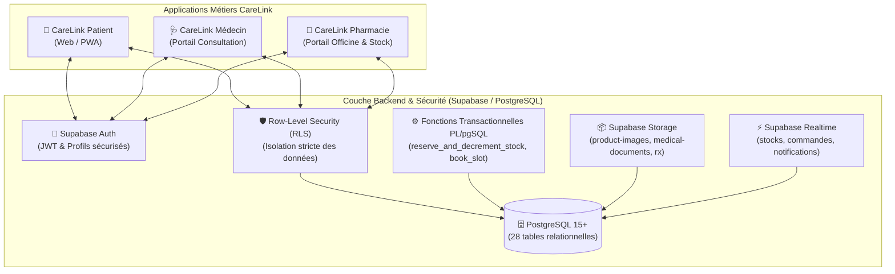

# CareLink — Architecture Globale & Flux Métiers

CareLink est une plateforme de santé unifiée interconnectant trois applications métiers distinctes autour d'un backend centralisé sous **PostgreSQL / Supabase**.

---

## 🔄 Flux Métier Interconnecté de Bout en Bout

### 1. Prise de Rendez-vous Sécurisée
1. Le médecin génère des créneaux de disponibilité réels dans `doctor_slots`.
2. Le patient recherche un médecin par spécialité, consulte ses créneaux et déclenche `book_appointment_slot()`.
3. La fonction verrouille le créneau (`FOR UPDATE`) évitant toute double réservation simultanée.
4. Dès la confirmation, un trigger crée un accès délégué `doctor_patient_access` temporaire autorisant le médecin à consulter le dossier médical du patient.

### 2. Consultation & Ordonnance Électronique
1. Le médecin effectue la consultation, saisit les antécédents, constantes vitales et diagnostic dans `consultations` et `medical_record_entries`.
2. Le médecin génère une ordonnance électronique dans `prescriptions` avec les lignes détaillées dans `prescription_items`.
3. L'ordonnance est signée numériquement et reste **strictement privée** entre le patient et le praticien.

### 3. Transfert Volontaire Vers une Pharmacie
1. Le patient choisit l'officine de son choix pour délivrer ses médicaments.
2. Le patient déclenche `transfer_prescription_to_pharmacy()`.
3. **Seule l'officine destinataire** reçoit la notification et l'autorisation RLS de consulter l'ordonnance et ses lignes.
4. L'officine vérifie ses stocks et prépare la délivrance.

### 4. Marketplace & Vente Transactionnelle Anti-Rupture
1. Le patient recherche des médicaments dans le marketplace multi-officinal.
2. La distance entre le patient et chaque pharmacie est calculée via la fonction géodésique `calculate_distance_km()`.
3. Le patient valide son panier multi-officines : une commande mère `orders` est générée, ventilée en sous-commandes `order_fulfillments` pour chaque pharmacie.
4. La fonction `reserve_and_decrement_stock()` applique un verrou pessimiste (`SELECT ... FOR UPDATE`) sur le stock de chaque médicament. Tout risque de stock négatif est rendu impossible au niveau moteur de la base.
5. Les pharmaciens traitent leurs fulfillments respectifs, avec mise à jour temps réel pour le patient via Supabase Realtime.
